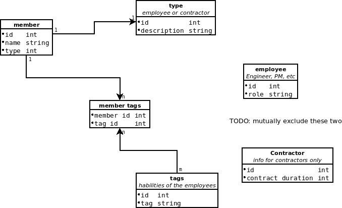

## Employee admin service

This is a local service for managing our employee database

The full technical requirements for this project so far can be seen in [REQS](PROJECT_REQS.md)

The overall DB structure is this



### Quick start running the service

Install Docker and Docker compose (usually shipped together), then run in the terminal
from the root of this project this command:

```bash
docker-compose -f run-local-service.yaml  up
```

It will download the latest build and connect to a local database with everything you need
to get started.

To see a few sample HTTP requests used during the development of this services, please
read [REST API](REST_API/README.md)

### Local development

In order to start the services needed you need to install Docker and Docker compose
(usually shipped together) in your development machine, there are a lot of resources
on how to do that.

Once the tool is up and running just run this in the project directory:
```bash
docker-compose up
```

It will start a local MySQL database and create the tables as defined in ./db/database.sql

To facilitate running during the development process, you can use the `air` command, it
will monitor changes in the source code and build and run for you the service, you can
start testing very easily with it.

https://github.com/cosmtrek/air

### Building and publishing the service

Request access to this private repository to see the CI/CD pipelines  
https://github.com/sir-farfan/litt/actions

### Project dashboard:

https://github.com/sir-farfan/litt/projects/1

#### Restarting the DB

The DB running in Docker will keep all your records across restarts, if you want
to delete everything for whatever reason, just run

```bash
docker compose rm
```

## Running with docker

### Public repository

Published and nightly build images can be found in Docker Hub at:
https://hub.docker.com/repository/docker/sulfurf/litt